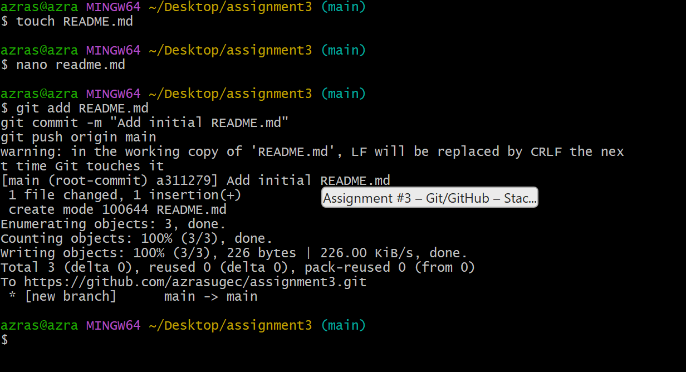
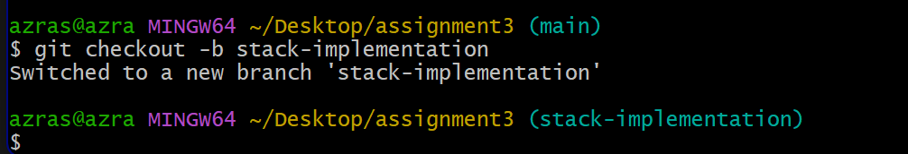
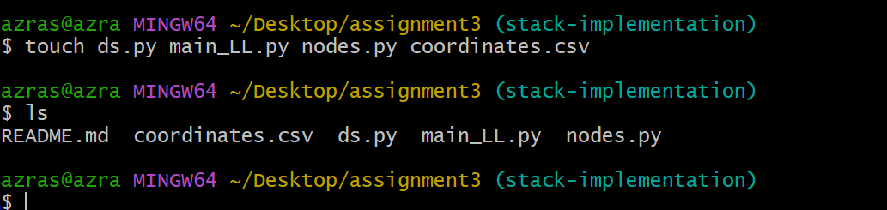
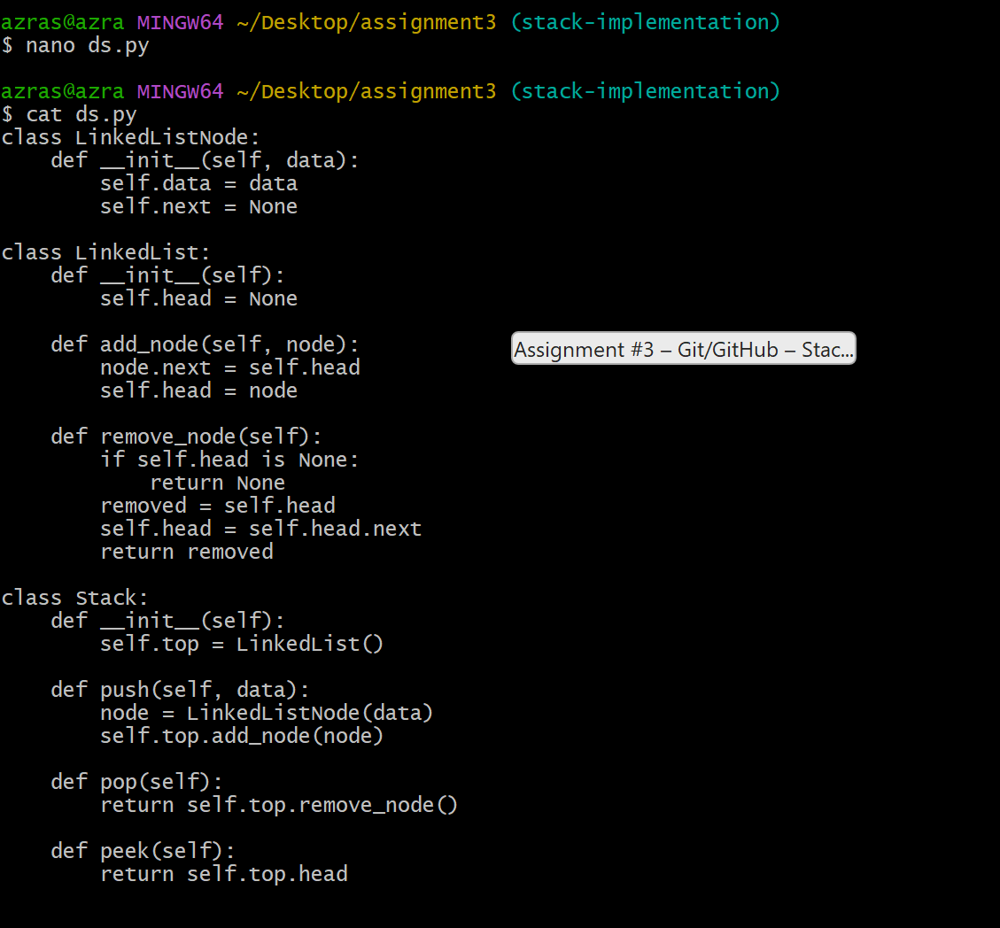
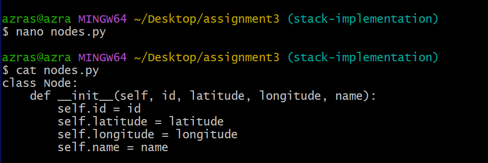
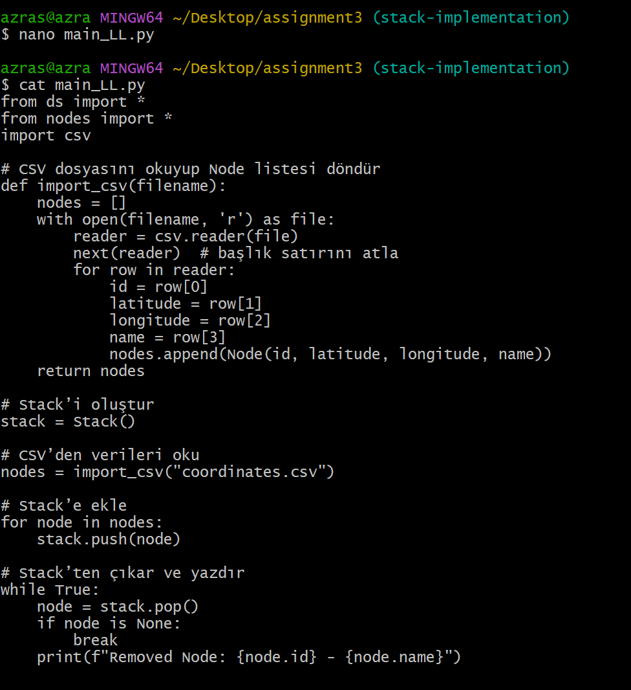
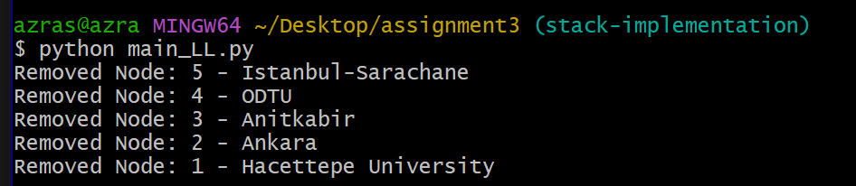
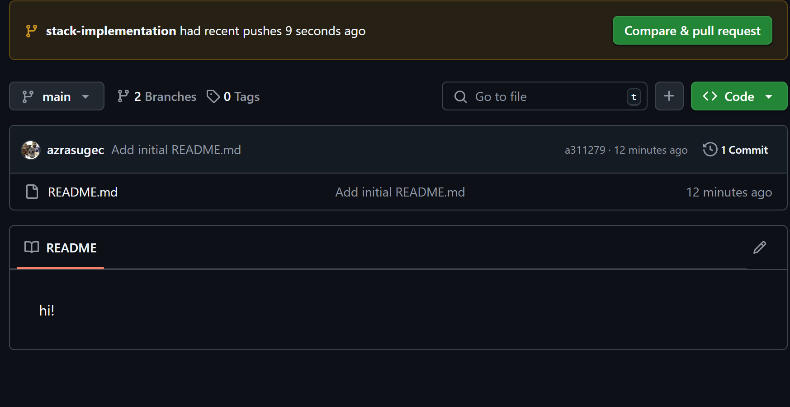
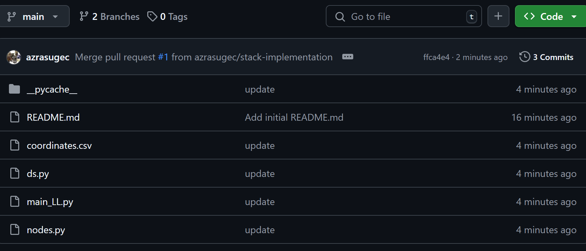

# Assignment #3– Git/GitHub – Stack Implementation with Linked List

## 📂 Repository Contents

- `ds.py` → Contains the stack implementation using a linked list.
- `nodes.py` → Defines the `Node` class with ID, latitude, longitude, and name.
- `coordinates.csv` → Stores sample node data in CSV format.
- `main_LL.py` → Handles CSV import, stack operations, and printing results.

---
# Assignment #3 – Git/GitHub – Stack Implementation using Linked List

This project is a part of Assignment #3 for the Git/GitHub module and demonstrates how to implement a **stack data structure** using a **linked list** in Python.

Throughout this assignment, a stack is built step by step, and all development processes are version-controlled using Git and documented on GitHub. Each task involves meaningful commits, terminal screenshots, and explanations to reflect a professional development workflow.

The aim is to both strengthen understanding of data structures (particularly stacks) and gain hands-on experience with essential Git/GitHub practices like branching, committing, and merging.

Below you will find the tasks completed in this project, accompanied by relevant explanations and screenshots.


## Task 1 – Creating the README File

In this task, a `README.md` file was created to serve as the documentation for the project. This file provides a step-by-step overview of the tasks and code implementation involved in building a stack using a linked list in Python.

The following commands were used to create, edit, and push the `README.md` file to the repository:



```bash
touch README.md
nano README.md
git add README.md
git commit -m "Add initial README.md"
git push origin main


## Task 2 – Creating a New Branch

In this step, a new branch named `stack-implementation` was created using the `git checkout -b` command. This branch isolates the stack implementation work from the `main` branch, ensuring a clean and manageable workflow.

The following command was used:

```bash
git checkout -b stack-implementation




## Task 3 – Creating Project Files

In this step, the necessary files for implementing the stack were created using the `touch` command. These include:

- `ds.py`: For implementing the stack and linked list classes.
- `main_LL.py`: The main Python script to run the program.
- `nodes.py`: Defines the data structure for each node.
- `coordinates.csv`: A CSV file storing sample node data.

The following command was used:

```bash
touch ds.py main_LL.py nodes.py coordinates.csv




## Task 4 – Implementing Stack Using Linked List

In this step, we implemented the core data structures of the project in `ds.py`. Three classes were defined:

- **LinkedListNode**: Represents a single node in the linked list, containing the data and a reference to the next node.
- **LinkedList**: Handles the linked list logic with `add_node()` and `remove_node()` methods to manage the stack behavior.
- **Stack**: Uses a `LinkedList` to implement the LIFO (Last-In-First-Out) structure with:
  - `push(data)`: Adds a new node to the top of the stack.
  - `pop()`: Removes the node from the top.
  - `peek()`: Returns the node at the top without removing it.

This implementation allows dynamic memory usage and efficient insertion/removal at the head of the list.




## Task 5 – Defining the Node Class

In this step, we created the `Node` class in `nodes.py` to represent the individual data elements to be stored in the stack. Each node contains:

- `id`: A unique identifier for the node,
- `latitude` and `longitude`: Geolocation coordinates,
- `name`: A label or name associated with the node.

This structure is essential for storing meaningful data within the stack, allowing us to track location-based information in a structured manner.




## Task 6 – Reading CSV and Using the Stack

In this step, we implemented the core logic in `main_LL.py`. The goal was to:

- **Read Data from a CSV File**: The `import_csv()` function opens the `coordinates.csv` file, skips the header, reads each row, and converts them into `Node` objects using the structure we defined earlier.
- **Push Data onto the Stack**: After reading the data, each `Node` is pushed onto the stack using the `push()` method.
- **Pop and Print**: In a loop, each `Node` is popped from the stack and printed until the stack is empty.

This step effectively demonstrates how to build and manipulate a stack using custom objects and real-world data.




## Task 7 – Running the Program and Verifying Output

In this step, we executed `main_LL.py` to test the full stack implementation. The terminal output confirms that the program correctly:

- Reads data from the CSV file,
- Pushes `Node` objects onto the stack,
- Pops them one by one following the **Last-In-First-Out (LIFO)** order,
- And prints the `id` and `name` of each removed node.

This output provides validation that our stack and linked list integration works as expected.




## Task 8 – Popping Nodes from the Stack

In this task, the final part of the program is executed: popping elements from the stack. Using a `while` loop, each `Node` is removed from the top of the stack until the stack is empty.

For every popped node, its `id` and `name` are printed to the console. This confirms that the **Last-In-First-Out (LIFO)** behavior of the stack is working correctly — the most recently added node is the first to be removed.




## Task 9 – Final Structure Review

In this final task, we review the complete project structure after all files and implementations have been added. The repository now includes:

- `ds.py`: Stack and linked list implementation
- `nodes.py`: Node class with location data
- `main_LL.py`: Main script to process the CSV and apply stack operations
- `coordinates.csv`: Sample dataset containing node information
- `README.md`: Documentation of the assignment

The project is now ready for submission, with a clean and organized structure. All changes have been committed and pushed to the `main` branch.




## 🧩 Task Summary

| Task No | Description                            | Git Action         |
|---------|----------------------------------------|--------------------|
| Task 1  | Initialized repository & README        | `git init`, `touch` |
| Task 2  | Created new branch                     | `git checkout -b`  |
| Task 3  | Created initial files                  | `touch` & `ls`     |
| Task 4  | Implemented stack structure in `ds.py` |                    |
| Task 5  | Created `Node` class                   |                    |
| Task 6  | Read CSV and processed stack logic     |                    |
| Task 7  | Output printed stack removal results   |                    |
| Task 8  | Confirmed LIFO behavior                |                    |
| Task 9  | Final project structure check          | `merge & push`     |


## ✅ Conclusion


With a fully functional stack built on linked lists and automated through CSV parsing, this project showcases modular design, real-world data processing, and clean Git management — from branching to merging.


